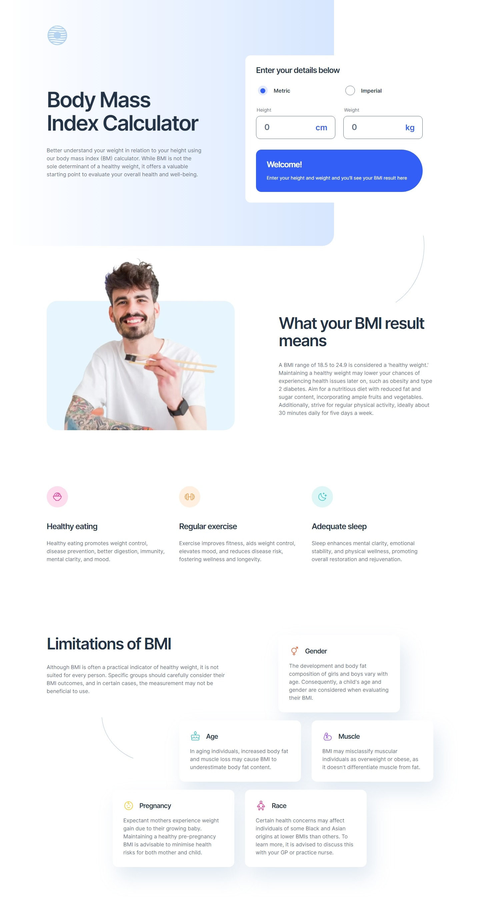

# Frontend Mentor - Body Mass Index Calculator solution

This is a solution to the [Body Mass Index Calculator challenge on Frontend Mentor](https://www.frontendmentor.io/challenges/body-mass-index-calculator-brrBkfSz1T).

## Table of contents

- [Overview](#overview)
  - [The challenge](#the-challenge)
  - [Screenshot](#screenshot)
  - [Links](#links)
- [My process](#my-process)
  - [Built with](#built-with)
- [Author](#author)

## Overview

### The challenge

Users should be able to:

- Select whether they want to use metric or imperial units
- Enter their height and weight
- See their BMI result, with their weight classification and healthy weight range
- View the optimal layout for the interface depending on their device's screen size
- See hover and focus states for all interactive elements on the page

### Screenshot

### Links

- Solution URL: [Mobile-first solution using Flexbox and Grid](https://www.frontendmentor.io/solutions/mobile-first-solution-using-flexbox-and-grid-YYX0I0WTtD)
- Live Site URL: [Body Mass Index Calculator](https://azganoth.github.io/bmi-calculator/)

## My process

### Built with

- HTML5
  - Semantic markup
- CSS3
  - Custom properties
  - Flexbox
  - Grid
- Mobile-first workflow

## Author

- Website - [Ademir José Ferreira Júnior](https://github.com/Azganoth)
- Frontend Mentor - [@Azganoth](https://www.frontendmentor.io/profile/Azganoth)
